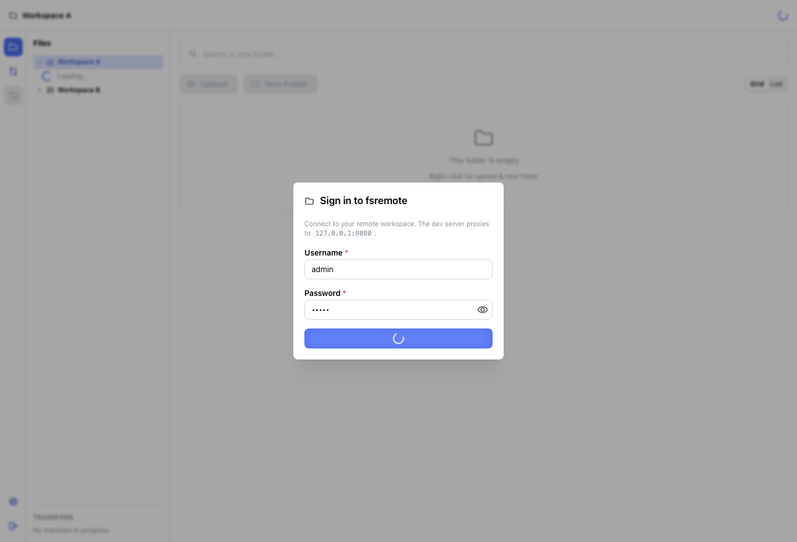
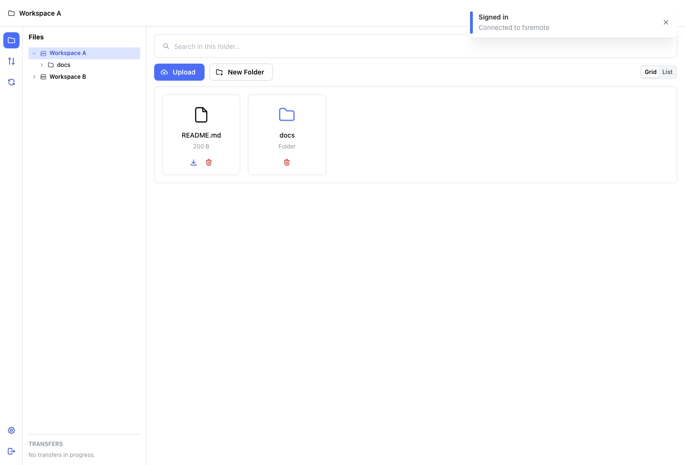

# fsremote

Rust service + React UI for collaborative access to allowlisted folders over HTTP/WebSocket.

## Requirements

- Rust toolchain: see [`rust-toolchain.toml`](rust-toolchain.toml) (1.88+).
- Node.js 20+ for the web UI.

## Quick start

**All-in-one (recommended):** stops anything on ports `8080` / `5173`, starts the Rust server, waits for `/health`, then starts Vite and opens the browser.

```bash
cd web && npm install   # first time only
./scripts/start.sh
```

Press **Ctrl+C** to stop the UI and the server.

---

1. Create the configured root and ensure `config.toml` paths exist (default `./data`):

```bash
mkdir -p data
```

2. Run the server (from repo root):

```bash
FSREMOTE_CONFIG=config.toml cargo run -p fsremote-server
```

Default bind: `127.0.0.1:8080`. Default login: `admin` / `admin` (see `config.toml`).

3. Run the web UI:

```bash
cd web && npm install && npm run dev
```

Open the printed URL (usually `http://127.0.0.1:5173`). Vite proxies `/api`, `/health`, and `/ws` to `127.0.0.1:8080`.

## Password hash

Generate a bcrypt hash for `config.toml`:

```bash
cargo run -p fsremote-server -- hash-password 'your-password'
```

## Layout

- [`crates/protocol`](crates/protocol) — JSON/binary wire types.
- [`crates/server`](crates/server) — Axum HTTP + WebSocket, JWT, filesystem ops, `notify` watchers, file logging.
- [`crates/wasm-client`](crates/wasm-client) — minimal WASM stub (protocol helpers); the browser worker implements the client in TypeScript today.
- [`web`](web) — React + Comlink worker.

## Author

Copyright (c) 2026 Vlad Sebeșan.

## License

This project is licensed under the MIT License.

The full license text is in [`LICENSE`](LICENSE).

## Screenshots

The project includes a lightweight gallery for GitHub Pages at [`docs/index.html`](docs/index.html), with actual captured screens from the local app in [`docs/screenshots`](docs/screenshots).





## Tests

```bash
cargo test --workspace
cd web && npm test
```
